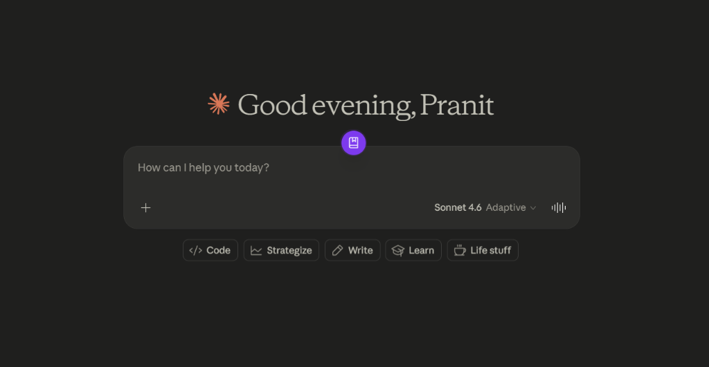
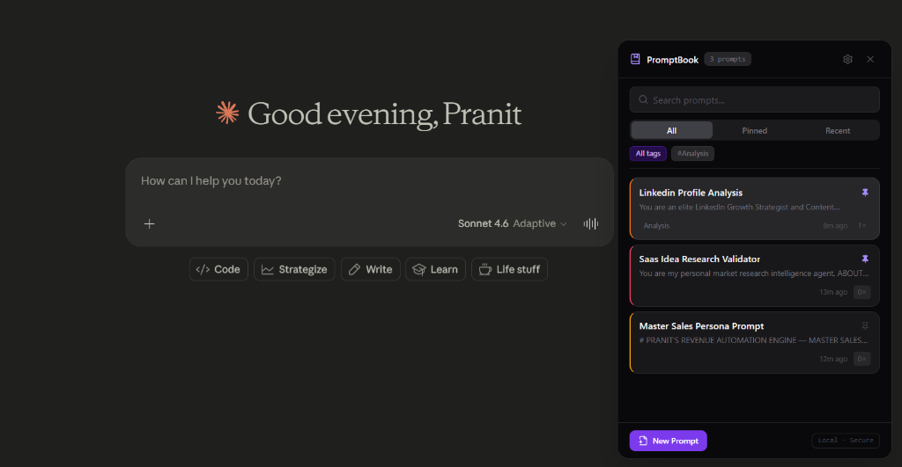
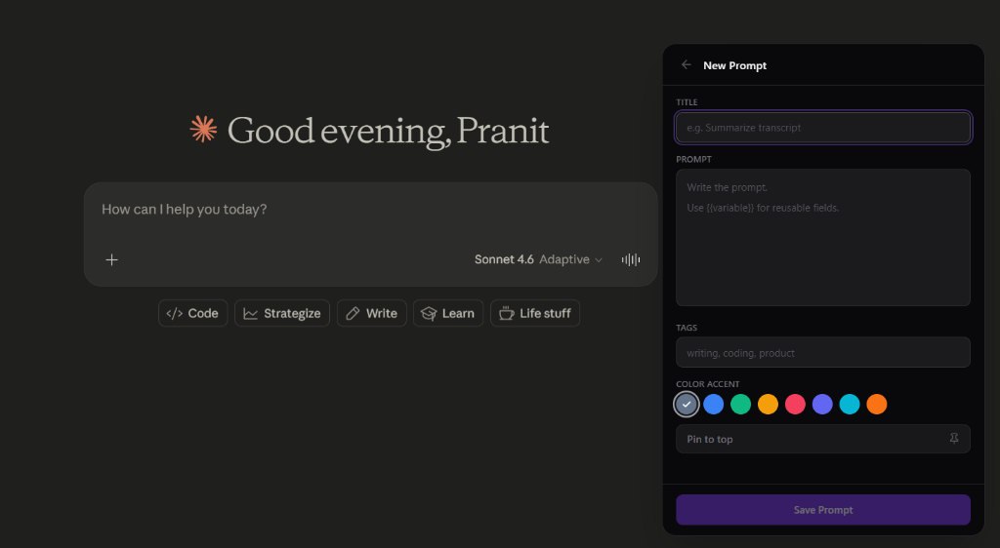
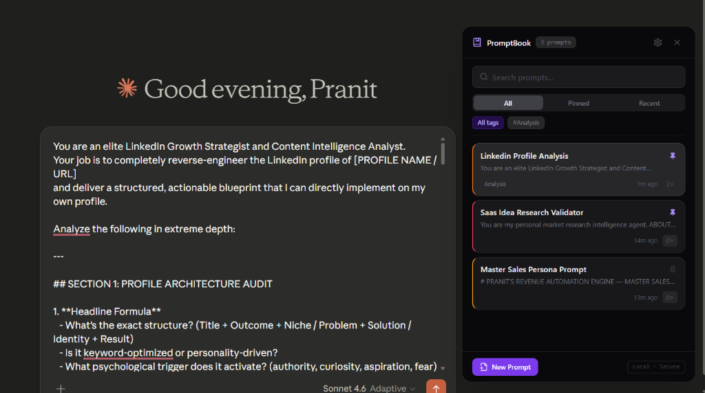

# PromptBook

**A local-first Chrome Extension that saves, searches, tags, and injects prompts directly into AI chat interfaces.**

PromptBook is a privacy-focused, lightning-fast prompt management vault built entirely in the browser. It allows you to save, search, and manage your AI prompts and instantly inject them into tools like ChatGPT, Claude, and Perplexity without ever leaving the active tab.

## Core Features
- **Local-First Privacy**: All your data lives exclusively in your browser's local IndexedDB. No backend, no accounts, no tracking.
- **Universal Injection**: Inject prompts directly into ChatGPT, Claude, and Perplexity using the floating UI.
- **Dynamic Variables**: Define variables like `{{topic}}` in your prompts and fill them in on the fly.
- **Fuzzy Search**: Instantly find prompts across titles, tags, and body content using Fuse.js.
- **Keyboard Shortcuts**: Summon PromptBook from anywhere using `Ctrl+Shift+P` (or `Cmd+Shift+P` on Mac).
- **Import/Export**: Export your entire vault as JSON for backup and easily import it across devices.

---

## Product Walkthrough

<p align="center">
  
  <br />
  <em>The PromptBook launcher button snaps cleanly onto any supported AI input area.</em>
</p>

<p align="center">
  
  <br />
  <em>Browse, search, and manage your library from the slide-out panel.</em>
</p>

<p align="center">
  
  <br />
  <em>Author prompts with dynamic variables, add tags, and customize colors.</em>
</p>

<p align="center">
  
  <br />
  <em>Select any prompt from your library to instantly inject it at your active cursor.</em>
</p>

---

## Usage

PromptBook hooks directly into your browser workflow to store, search, and reuse prompt templates.

### Basic Workflow
1. **Locate the Launcher**: Open any supported AI chat interface (ChatGPT, Claude, or Perplexity). A purple PromptBook floating launcher icon will appear attached to the chat window input box.
2. **Access your Library**: Click the launcher button to open the slide-out PromptBook panel.
3. **Search & Filter**: Type in the top search bar to search prompts instantly, or filter by tabs (**All**, **Pinned**, **Recent**) or tags.
4. **Inject**: Click any prompt card in the list to automatically write the prompt template directly into your active chat box.

### How to Create a Prompt
1. Click the **New Prompt** button at the bottom of the sidebar.
2. Fill in the **Title** and **Prompt** body.
   - Use `{{variable_name}}` inside your prompt text to define placeholder fields that you can fill in dynamically on runtime injection.
3. Add optional comma-separated **Tags** for categorization.
4. Choose a custom **Color Accent** color to visually group or highlight the prompt card.
5. Optionally toggle **Pin to top** to keep this prompt pinned at the top of your list.
6. Click **Save Prompt**.

### How to Reuse a Prompt
- When you click a prompt card containing variables (e.g., `{{topic}}`), PromptBook will highlight those variables inline.
- The prompt will be injected directly into the host chat input at the active text cursor position.

> [!NOTE]
> **Local-First Privacy**: PromptBook does not connect to any servers. All prompts, metadata, and configuration options remain inside your browser profile's local IndexedDB instance. No accounts are required, and no data leaves your local machine unless you explicitly use the JSON Export feature.

---

## Tech Stack
- **Framework**: React 18
- **Language**: TypeScript
- **Styling**: Tailwind CSS
- **Database**: Dexie.js (IndexedDB wrapper)
- **Search**: Fuse.js
- **Build Tool**: Vite (Multi-build setup for popup and content scripts)
- **Extension standard**: Manifest V3

## Project Structure
```text
promptbook-extension/
├── src/
│   ├── background/    # Service worker (stateless event relay)
│   ├── components/    # Reusable React UI components
│   ├── content/       # Content scripts for floating UI and DOM injection
│   ├── hooks/         # Custom React hooks (e.g., useToast)
│   ├── lib/           # Core logic (db.ts, search.ts, utils.ts)
│   ├── types/         # Shared TypeScript interfaces
│   ├── App.tsx        # Main popup component
│   └── main.tsx       # Popup entry point
├── index.html         # Popup UI HTML template
├── manifest.json      # Chrome Extension Manifest V3
├── vite.config.ts     # Vite build config for popup and background
└── vite.content.config.ts # Vite build config for content script isolation
```

## Local Setup
1. Clone the repository
2. Install dependencies:
   ```bash
   npm install
   ```

## Development Commands
To run the project in development mode (which opens a Vite dev server for the popup UI):
```bash
npm run dev
```

## Build Command
To compile the extension for Chrome:
```bash
npm run build
```
This runs `tsc`, builds the popup and background scripts, and then separately builds the isolated content scripts into the `dist/` directory.

## How to Load the Extension in Chrome
1. Run `npm run build` to generate the `dist/` folder.
2. Open Chrome and navigate to `chrome://extensions/`.
3. Enable **Developer mode** in the top right corner.
4. Click **Load unpacked** in the top left.
5. Select the `dist/` folder inside the project directory.
6. The extension is now installed. You can pin it to your toolbar.

## How Local Storage Works
PromptBook relies entirely on **IndexedDB** (via Dexie.js) to store all prompts and settings. Your data is strictly bound to your local browser profile. It also uses `chrome.storage.local` to temporarily persist the position of the floating UI and the pending text you select and right-click to "Save to PromptBook". 

## Known Limitations
- The floating UI injection currently officially supports ChatGPT, Claude, and Perplexity. On unsupported sites, the floating UI will not appear.
- JSON exports must be manually synced if you wish to use PromptBook across multiple devices.

## Roadmap
- **Prompt Versioning**: Track edit history and easily roll back changes.
- **Folder Organization**: Group prompts into customizable collections.
- **Local Analytics**: Track most used prompts and generate usage digests.
- **Starter Templates**: A library of built-in prompts that you can copy to your vault.

## License
MIT License. See [LICENSE](LICENSE) for details.

## Author
Built by Pranit Patil.
